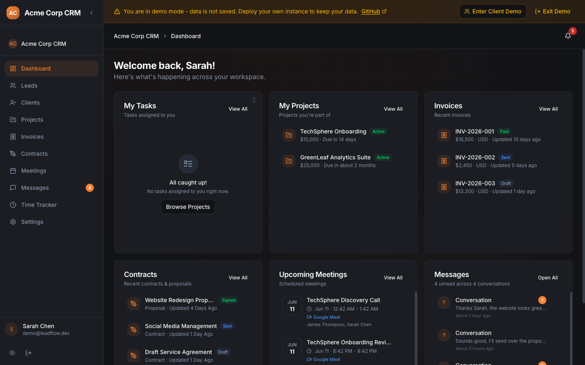
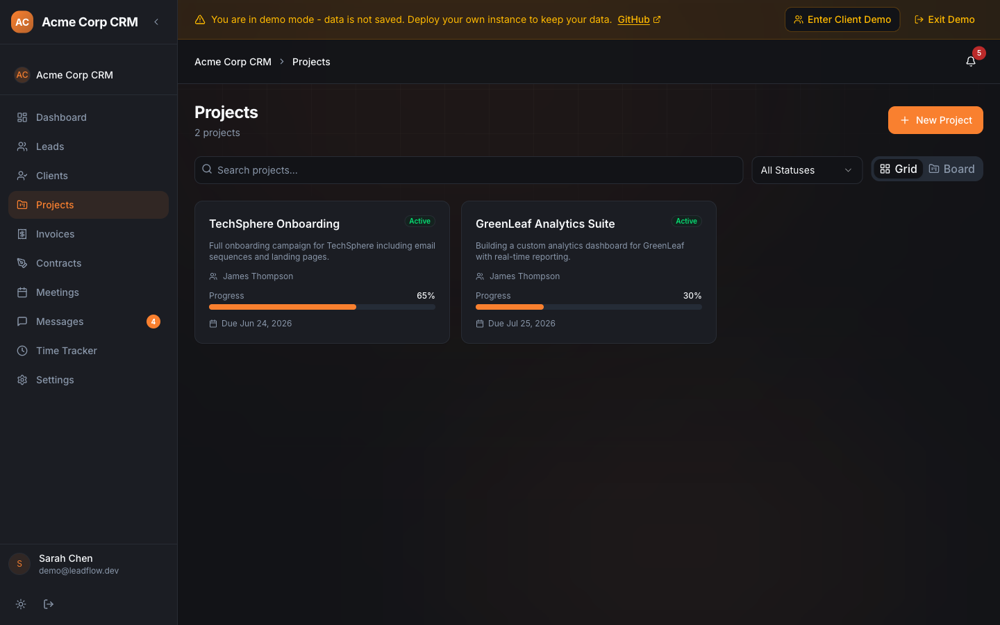
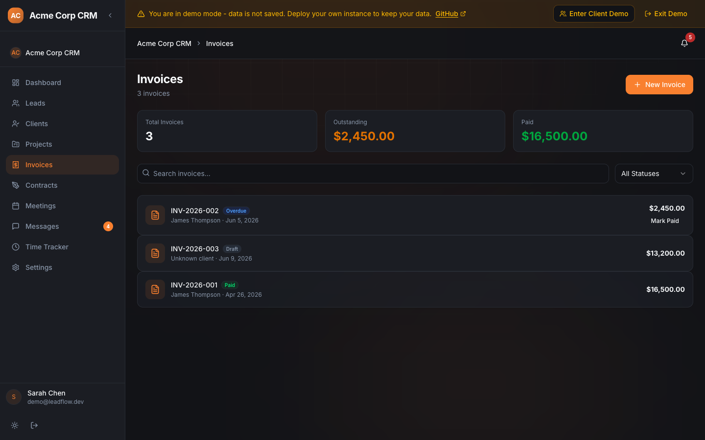

# LeadFlow CRM

**Open-source CRM for freelancers, small teams, and agencies. Own your data. Zero vendor lock-in.**

LeadFlow is a full-featured customer relationship management platform built with Next.js 16 on Firebase. Manage contacts with spreadsheet-powered data, schedule meetings, collaborate with your team, and analyze performance — self-hosted on your own infrastructure.

<p align="center">
  
  
  
  
  
  
</p>

<p align="center">
  <a href="#try-the-live-demo">Try Live Demo</a> •
  <a href="#features">Features</a> •
  <a href="#quick-start">Quick Start</a> •
  <a href="#why-leadflow">Why LeadFlow</a> •
  <a href="#documentation">Documentation</a>
</p>

---

## Try the Live Demo

No signup required. Click below to explore the full platform in demo mode:

<p align="center">
  <a href="https://crm.tabishbinishfaq.dev/login">
    
  </a>
</p>

---

## Why LeadFlow

Most CRMs lock you into monthly subscriptions, limit your data portability, and charge more as your team grows.

**LeadFlow is different:**

- **Self-hosted** - Deploy on your own infrastructure. Firebase Spark plan is free forever.
- **Open source (MIT)** - No hidden costs, no per-seat pricing, no surprises.
- **Your data stays yours** - No vendor lock-in. Export anytime.
- **Deploy anywhere** - Vercel, Node.js server, or your own infrastructure.
- **Under 10 minutes** - From clone to running.

---

## Free Tier Infrastructure (What This Runs On)

LeadFlow runs entirely on **free tiers** of best-in-class services. Your only cost is your domain.

| Service             | Free Tier Limit                                  | What It Powers              |
| ------------------- | ------------------------------------------------ | --------------------------- |
| **Firebase Spark**  | 50k reads/day, 20k writes/day, 1GB storage       | Auth, database, storage     |
| **Vercel Hobby**    | 100GB bandwidth, 100k function invocations/month | Next.js deployment          |
| **Cloudinary Free** | 25GB storage, 25GB bandwidth                     | File/image storage          |
| **Resend Free**     | 3,000 emails/month, 100/day                      | Transactional emails        |
| **Google APIs**     | Free within quota                                | Google Login, Calendar sync |
| **Sentry Free**     | 5k errors/month                                  | Error monitoring            |

These are the actual free-tier limits. A solo freelancer or small team will hit none of them in normal use. When you outgrow them, each service offers a cheap paid upgrade with no lock-in.

---

## Screenshots

### Dashboard

<p align="center">
  
  <br />
  <em>Dashboard with tasks, projects, invoices, meetings and messages widgets. Drag-and-drop to reorder cards.</em>
</p>

### Leads (Spreadsheet)

<p align="center">
  
  <br />
  <em>Lead spreadsheet view with data management and filtering capabilities.</em>
</p>

<p align="center">
  
  <br />
  <em>Spreadsheet detail view with full data editing and column management.</em>
</p>

### Projects

<p align="center">
  
  <br />
  <em>Project list with progress tracking, budgets, and deadlines.</em>
</p>

<p align="center">
  
  <br />
  <em>Project detail view with tasks, milestones, deliverables, and team collaboration.</em>
</p>

### Invoices

<p align="center">
  
  <br />
  <em>Invoice list with status tracking (paid, sent, draft, overdue) and client information.</em>
</p>

<p align="center">
  
  <br />
  <em>Invoice detail with line items, tax calculation, and payment history.</em>
</p>

### Contracts

<p align="center">
  
  <br />
  <em>Contract and proposal management with e-signatures and status tracking.</em>
</p>

### Meetings

<p align="center">
  
  <br />
  <em>Meeting calendar with scheduling, Google Meet integration, and booking pages.</em>
</p>

### Messages

<p align="center">
  
  <br />
  <em>Team messaging with read receipts, reply threading, and conversation management.</em>
</p>

### Time Tracking

<p align="center">
  
  <br />
  <em>Time tracking with start/stop timer, manual entry, per-project billable hours.</em>
</p>

### Clients

<p align="center">
  
  <br />
  <em>Client management with contact details, linked projects, invoices, and activity history.</em>
</p>

### Settings & Themes

<p align="center">
  
  <br />
  <em>Profile settings with display name, photo, and account management.</em>
</p>

<p align="center">
  
  <br />
  <em>Workspace settings for team configuration and branding.</em>
</p>

<p align="center">
  
  <br />
  <em>Accent color themes (18 options), dark/light mode, and interface preferences.</em>
</p>

---

## Who Is This For

| Audience           | Why LeadFlow Fits                                                                          |
| ------------------ | ------------------------------------------------------------------------------------------ |
| **Freelancers**    | Track leads, manage projects, send invoices, time track--- all in one place. Free to host. |
| **Small Agencies** | Multi-workspace support, role-based access (Owner/Admin/Member/Viewer), team collaboration.   |
| **Developers**     | Full TypeScript, clean architecture, Firebase backend, easy to customize and extend.       |
| **Startups**       | Ship a complete CRM without building from scratch. MIT license means no restrictions.      |

---

## Features

### Core CRM

| Module                 | What You Get                                                                                                                            |
| ---------------------- | --------------------------------------------------------------------------------------------------------------------------------------- |
| **Lead Management**    | Spreadsheet-powered data management with CRUD, real-time sync, advanced filters, CSV import, bulk operations, duplicate detection       |
| **Contact Management** | Store contacts, companies, deals — all linked together with activity history                                                            |

### Sales & Communication

| Module                    | What You Get                                                                                                                                                                                   |
| ------------------------- | ---------------------------------------------------------------------------------------------------------------------------------------------------------------------------------------------- |
| **Email**                 | Resend integration (primary), Brevo fallback, open/click tracking (tracking pixel + link rewrite), email history per lead, draft management                                                      |
| **Messaging**             | Real-time chat (lead + team), reply threading, read receipts (double checkmarks), reactions, file attachments, auto-open last conversation                                                     |
| **Meetings & Scheduling** | Public booking pages with timezone-aware slot selection, configurable meeting types (30/45/60 min), Google Meet creation, conflict detection, custom booking questions, confirmation redirects |
| **Calendar**              | Month/week/day views, create/edit/delete events, Google Calendar OAuth sync, upcoming events on dashboard                                                                                      |

### Operations

| Module            | What You Get                                                                                                                          |
| ----------------- | ------------------------------------------------------------------------------------------------------------------------------------- |
| **Dashboard**     | Drag-and-drop reorderable cards for each module (Tasks, Projects, Invoices, Contracts, Meetings, Messages). Permission-gated visibility. Card order persists per user. |
| **Time Tracking** | Live stopwatch, manual entries, per-lead association, billable tracking, daily grouped view, real-time sync                           |
| **Documents**     | Cloudinary upload (drag-and-drop), preview, type icons, 10MB limit, per-lead and per-workspace organization, delete with confirmation |
| **Analytics**     | KPI cards, time-series charts, revenue/source distributions, conversion funnel, industry breakdown, PDF export               |
| **Notifications** | Real-time in-app notification bell with unread count badge, mark all read, delete, color-coded icons by type                          |

### Team & Workspace

| Module              | What You Get                                                                                             |
| ------------------- | -------------------------------------------------------------------------------------------------------- |
| **Workspaces**      | Multi-workspace membership, 4 roles (Owner/Admin/Member/Viewer), email invite system, full audit logging |
| **User Management** | Editable profiles (name, photo), synced across workspace member views, role-based permissions            |

### Client Portal

| Module              | What You Get                                                                                             |
| ------------------- | -------------------------------------------------------------------------------------------------------- |
| **Projects**        | Clients view assigned projects with status and progress tracking                                         |
| **Invoices**        | Clients view their invoices with status badges (paid, overdue, sent)                                     |
| **Contracts**       | Clients view and sign contracts/proposals shared with them                                               |
| **Meetings**        | Clients view upcoming meetings they're invited to                                                        |
| **Messages**        | Real-time messaging between clients and team members                                                     |
| **Portal Settings** | Welcome cards, onboarding checklists, helpful links/files configurable per workspace                     |

### Customization

| Feature                | Details                                      |
| ---------------------- | -------------------------------------------- |
| **Accent Colors**      | 18 color themes applied across the entire UI |
| **Theme**              | Dark mode + light mode                       |
| **Custom Lead Fields** | Define your own data model for leads         |

---

## Demo (No Signup)

Visit the live demo to see everything in action without creating an account:

```
https://crm.tabishbinishfaq.dev
```

The demo is pre-loaded with sample data so you can test every feature immediately.

---

## Tech Stack

| Layer            | Technology                                                 |
| ---------------- | ---------------------------------------------------------- |
| Framework        | Next.js 16 (App Router)                                    |
| Language         | TypeScript 5.8 (strict mode)                               |
| UI               | React 19, Tailwind CSS 4, shadcn/ui (20+ primitives)       |
| State Management | Zustand 5, TanStack Query 5                                |
| Database         | Firestore (Firebase) with real-time listeners              |
| Authentication   | Firebase Auth (Email, Google, GitHub) + Firebase Admin SDK |
| File Storage     | Cloudinary (documents), Firebase Storage (fallback)        |
| Email            | Resend (primary, transactional with open/click tracking), Brevo (optional fallback) |
| Calendar         | Google Calendar API / Google Meet integration                                       |
| Scheduling       | n8n Workflow SDK (meeting booking workflows)                                        |
| Charts           | Recharts 2 (line, bar, pie, donut, funnel)                                          |
| Drag and Drop    | @dnd-kit (core, sortable, utilities)                                                |
| Tables           | TanStack Table 8                                                                    |
| Forms            | React Hook Form 7 + Zod 3 validation                                                |
| Testing          | Vitest 4 + Testing Library                                                          |
| CI/CD            | GitHub Actions (lint, typecheck, build, Firestore deploy)                           |
| Deploy           | Vercel (frontend + serverless functions)                                            |

---

## Quick Start

### Prerequisites

- Node.js 22+, npm 10+
- A Firebase project (free Spark plan is sufficient)
- Optional: Resend, Cloudinary, Google Cloud accounts (for email, documents, calendar features)

### Install and Run

```bash
# Clone the repo
git clone https://github.com/Tabish5858/Leadflow-CRM.git
cd Leadflow-CRM

# Install dependencies
npm install

# Set up environment variables
cp .env.example .env.local

# Start development server
npm run dev
```

Open [http://localhost:3000](http://localhost:3000).

---

## Documentation

Complete setup guides for self-hosting LeadFlow CRM:

| Guide                          | What It Covers                                                   |
| ------------------------------ | ---------------------------------------------------------------- |
| [Getting Started](https://crm.tabishbinishfaq.dev/docs/getting-started) | Fork, clone, and install dependencies                    |
| [Firebase Setup](https://crm.tabishbinishfaq.dev/docs/firebase-setup)   | Auth, Firestore, Storage configuration                  |
| [Cloudinary Setup](https://crm.tabishbinishfaq.dev/docs/cloudinary-setup) | File and document storage                               |
| [Resend Setup](https://crm.tabishbinishfaq.dev/docs/resend-setup)       | Transactional email with domain verification             |
| [Google Calendar](https://crm.tabishbinishfaq.dev/docs/google-calendar-setup) | Calendar API, OAuth, and credentials                    |
| [Environment Variables](https://crm.tabishbinishfaq.dev/docs/env-variables) | Full reference for all config values                     |
| [Sentry Setup](https://crm.tabishbinishfaq.dev/docs/sentry-setup)       | Error tracking and performance monitoring                |
| [Deploy to Production](https://crm.tabishbinishfaq.dev/docs/deploy)     | Deploy on Vercel or your own Node.js server              |
| [Architecture](https://crm.tabishbinishfaq.dev/docs/architecture)       | System overview, data flow, and security model           |

View all guides at **[crm.tabishbinishfaq.dev/docs](https://crm.tabishbinishfaq.dev/docs)**.

---

### Environment Variables

| Variable                              | Purpose                                        |
| ------------------------------------- | ---------------------------------------------- |
| `NEXT_PUBLIC_FIREBASE_*` (6 vars)     | Firebase Auth, Firestore, Storage              |
| `FIREBASE_ADMIN_*` (3 vars)           | Admin SDK for API routes                       |
| `NEXT_PUBLIC_APP_URL`                 | OAuth redirects, invite links                  |
| `RESEND_API_KEY` (or `BREVO_API_KEY`) | Email sending (Resend primary, Brevo fallback) |
| `CLOUDINARY_*` (3 vars)               | Document/file storage                          |
| `GOOGLE_*` (4 vars)                   | Calendar integration, Google Meet              |

### Firebase Setup

1. Enable Authentication providers (Email/Password, Google, GitHub)
2. Create a Firestore database (production mode)
3. Enable Firebase Storage
4. Deploy security rules: `firestore.rules`
5. Deploy indexes: `firestore.indexes.json`

---

## Project Structure

```
leadflow/
  src/
    app/                    # Next.js App Router
      (auth)/               # Login, Register, Forgot/Reset Password
      (dashboard)/          # Dashboard, Leads, Analytics,
                            # Time Tracker, Messages, Meetings, Settings
      b/[token]/            # Public meeting booking pages
      invite/accept/        # Workspace invite acceptance
      api/                  # API routes
    components/
      ui/                   # shadcn/ui primitives
      leads/                # Lead form, detail, filters, score badge, CSV import,
                            #   documents, email composer, activity timeline

      meetings/             # Meeting type dialog, calendar tab, booking questions,
                            #   public booking page client
      messages/             # Conversation list, message thread, input, reply threading,
                            #   read receipt indicators, sidebar unread badge
      notifications/        # Notification bell with dropdown, real-time listener
      settings/             # Custom fields editor, calendar connection
      shared/               # Page header, stat card, status badge, export button, empty state
      skeletons/            # Loading placeholders (card, chart, table, list)
      workspace/            # Workspace switcher, invite dialog
    lib/
      firebase/             # Database operations
      stores/               # Zustand stores
      hooks/                # Custom hooks
      schemas/              # Zod validation schemas
      constants/            # Sources, niches
      calendar.ts           # Google Calendar OAuth + API
      cloudinary-config.ts  # Cloudinary config (client-safe)
      csv.ts                # CSV parsing/generation
      email-templates.ts    # HTML email templates
      email-tracking.ts     # Tracking pixel and link rewriting
      export.ts             # CSV/Excel/PDF export
      lead-filters.ts       # Filter state with URL sync
      audit-log.ts          # Audit trail
      permissions.ts        # Role-based access control
    types/                  # TypeScript interfaces
    contexts/               # Workspace context, Accent color context, header actions
  firestore.rules           # Security rules with role-based access
  firestore.indexes.json    # Composite indexes
  .env.example              # Environment template
```

---

## API Routes

| Method          | Route                           | Purpose                              |
| --------------- | ------------------------------- | ------------------------------------ |
| POST            | `/api/email/send`               | Send email via Resend with tracking  |
| GET             | `/api/email/track/open/[id]`    | Open tracking pixel (1x1 GIF)        |
| GET             | `/api/email/track/click/[id]`   | Click tracking redirect              |
| POST            | `/api/documents/upload`         | Upload to Cloudinary                 |
| GET/DELETE      | `/api/documents/list`           | List/delete documents                |
| GET             | `/api/auth/google`              | Initiate Calendar OAuth              |
| GET             | `/api/auth/google/callback`     | OAuth callback handler               |
| GET/POST/DELETE | `/api/calendar/events`          | Calendar event CRUD                  |
| GET             | `/api/calendar/status`          | Calendar connection status           |
| POST            | `/api/meetings/instant`         | Create Google Meet                   |
| GET/POST        | `/api/meetings/types`           | List/create meeting types            |
| PUT/DELETE      | `/api/meetings/types/[id]`      | Update/delete meeting type           |
| GET             | `/api/meetings/book/[token]`    | Public booking page data             |
| POST            | `/api/meetings/book/[token]`    | Book a meeting (public)              |
| POST            | `/api/meetings/schedule`        | Schedule meeting (internal)          |
| POST            | `/api/workspaces/invite`        | Send workspace invite                |
| POST            | `/api/workspaces/invite/accept` | Accept invite                        |
| GET/POST        | `/api/auth/forgot-password`     | Custom password reset                |
| GET             | `/api/workspaces/can-create`    | Check workspace creation permissions |

---

## Firestore Collections

| Collection               | Description                                                        |
| ------------------------ | ------------------------------------------------------------------ |
| `leads`                  | Lead records with value, source                                    |
| `activities`             | Per-lead activity timeline                                         |
| `audit_logs`             | Workspace audit trail                                              |
| `emails`                 | Email history with tracking                                        |
| `email_events`           | Open/click tracking events                                         |
| `documents`              | Cloudinary document metadata                                       |
| `timeEntries`            | Time tracking records                                              |
| `conversations`          | Message conversations with unread counts                           |
| `messages`               | Individual messages with reactions, read receipts, reply threading |
| `meetings`               | Meeting records (Google Meet, internal, public booking)            |
| `meeting_types`          | Reusable meeting type templates                                    |
| `notifications`          | In-app notifications                                               |
| `workspaces`             | Workspace configuration, member roles                              |
| `workspace_invites`      | Pending invitations                                                |
| `users`                  | User profiles                                                      |
| `password_reset_tokens`  | Self-managed password reset tokens                                 |
| `projects`               | Project records                                                    |
| `project_tasks`          | Project-scoped tasks with assignee, priority, due dates            |
| `project_milestones`     | Milestone tracking per project                                     |
| `project_deliverables`   | Deliverable submission and approval workflow                       |
| `invoices`               | Invoice records with line items, payments, proof of payment        |
| `contracts`              | Contract/proposal records with e-signatures and activity log       |
| `contract_templates`     | Reusable contract templates                                        |
| `client_documents`       | Client-facing document metadata                                    |
| `client_portal_settings` | Per-workspace client portal configuration (modules, welcome card)  |

---

## Security

LeadFlow follows defense-in-depth security practices:

| Layer              | Protection                                                                                                                       |
| ------------------ | -------------------------------------------------------------------------------------------------------------------------------- |
| **Edge**           | Cloudflare WAF (OWASP Core Ruleset, rate limiting, bot management, DDoS protection)                                              |
| **Database**       | Firestore security rules with role-based -ss -`canWrite()`, `getWorkspaceRole()`, `canManageWorkspace()`, owner-only operations  |
| **Application**    | Server Action re-authorization, Admin SDK confined to API routes, `server-only` guards on data access, input validation with Zod |
| **Authentication** | Firebase Auth with optional MFA, custom password reset tokens (1hr expiry), rate-limited invite acceptance                       |
| **Audit**          | Full audit trail (who, what, when) on all mutations                                                                              |

---

## Scripts

| Command                 | Description           |
| ----------------------- | --------------------- |
| `npm run dev`           | Start dev server      |
| `npm run build`         | Production build      |
| `npm run start`         | Production server     |
| `npm run lint`          | ESLint                |
| `npm run format`        | Prettier              |
| `npm run typecheck`     | TypeScript type check |
| `npm run test:run`      | Run tests once        |
| `npm run test:coverage` | Coverage report       |

---

## Contributing

See [CONTRIBUTING.md](CONTRIBUTING.md) and [CODE_OF_CONDUCT.md](CODE_OF_CONDUCT.md).

Workflow: Fork, branch from `develop`, conventional commits, PR to `develop`.

Open issues: [github.com/Tabish5858/Leadflow-CRM/issues](https://github.com/Tabish5858/Leadflow-CRM/issues)

### Priority Contribution Areas

- Test coverage expansion
- E2E tests with Playwright
- Gmail OAuth integration
- PWA / offline mode
- Deployment configuration (Vercel / Node.js)
- App Check enforcement
- CSP headers

---

## License

[MIT](LICENSE) - Free for personal and commercial use. No restrictions, no strings attached.

---

<p align="center">
  <strong>Star the repo</strong> if you find this useful.<br />
  Built with TypeScript, Next.js, Firebase. Fork it, extend it, make it yours.
</p>
